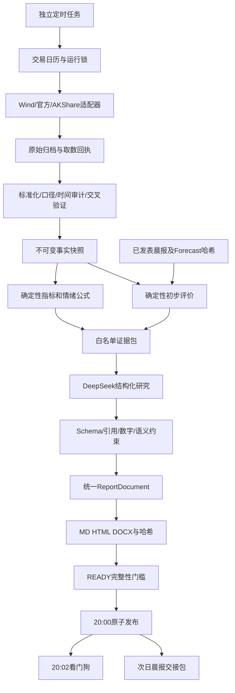

# 01 架构与需求裁决

## 1. 需求裁决
|原文要求/假设|实施裁决|
|---|---|
|20:00触发，此时数据最完整|20:00为发布目标；19:15预采集，19:40刷新，19:45冻结，19:57 READY；不宣称届时所有数据已齐|
|一律当日收盘|行情严格当日最终收盘；两融/宏观单列实际trade_date或period与发布时间，不冒充当日值|
|Wind不可用时AKShare补充，同时禁止非权威填充|Wind为主。补充源必须预登记，逐项标来源；核心行情只剩辅助源时PARTIAL、不能写Wind已核验|
|冲突以Wind为准|展示Wind主口径并显著标冲突、保留两值；未裁决字段不能驱动温度计/预测判定；官方同口径数据裁决，不平均|
|20:00两融T+1已经落库|按实际可得时间与交易日期判断；T-1值可作背景，不能给当日情绪因子冒用|
|读取旧晨报Markdown猜预测|从同日同模式已发表publication引用不可变forecast.json，验证hash；正文摘录只作展示|
|每维命中/部分/脱靶|仅对具备事前规则与成熟实际值的维度确定性计算；缺失为NA，未预测为NOT_PREDICTED|
|已有ledger_backfill --multi为正式打分|先核验旧脚本、schema、幂等和晨报兼容；未验证不调用。现有morning_brief evaluate为优先适配对象，禁止双写|
|温度计五因子，但无公式|新增透明、版本化规则见02；任何必要因子/历史窗不足，分数null|
|固定Wind+中金点睛声明|仅列实际消费且许可覆盖的数据源；无中金内容不得声明使用中金|
|盘面细节与资金归因|日K不能证明盘中过程；大单净流入不是机构真实买卖；消息相关性不能直接称因果|
|休市跳过|使用有效交易日历，休市写SKIPPED；未知日历硬失败，不用周末推测|
|三件套|全部一致且校验成功才能正常READY；导出失败独立告警，不能声称完整发布|
|“明日”|按下一A股交易日解析；港股单独日历，不以A股休市推定港股状态|

## 2. 结构

执行组件是有界函数/服务，不需要多个模型Agent自由取数。LLM无数据库连接、无本机工具、无任意URL抓取能力。

## 3. 模块与隔离
src/post_market_review/：cli、config、calendar_adapter、providers、normalization、audit、features、comparison、evidence、research、validation、document、exporters、publication、handoff、store。
config/review/：runtime.json、datasets.json、metric_rules.json、scoring_rules.json、source_policies.json。
state/review/ledger.sqlite 独立数据库，WAL+busy_timeout=5000ms；短事务，网络调用和Word渲染不得占用事务。
data/review/raw/{provider}/{dataset}/{date}/{receipt_id}；staging/review/{date}/{run_id}。
晨报只通过只读适配器读已发表索引，读不到则NA，不反向修改预测。

运行状态：CREATED→COLLECTING→FROZEN→ANALYZED→RENDERED→READY→PUBLISHED。
异常状态FAILED、SKIPPED；研究状态独立为DEEPSEEK_VALIDATED/PARTIAL_VALIDATED/TEMPLATE_FALLBACK。
业务状态COMPLETE/PARTIAL/FAILURE_BULLETIN：COMPLETE需三指数收盘涨跌幅、沪深成交额、宽度、行业全排名、情绪五因子与有效历史；资金和消息逐项披露不影响基础COMPLETE。COMPLETE不等于双源PASS，verification_status单列。三指数有任一合格收盘且未齐全可PARTIAL；全部核心指数不可用为FAILURE_BULLETIN。

## 4. 发布事务
独立唯一键(report_type=post_market_review,report_date,slot=20:00,mode)。
生产/影子严格隔离；影子只写项目内daily-reports/review/shadow/，不占正式中文目录。
先把全部文件写同卷临时目录，校验schema与hash，记录PREPARED事务，rename为不可变run目录，再事务提交PUBLISHED；崩溃恢复按manifest对账。
中文三件套为只读阅读副本；三文件不存在真正跨文件原子性，最后写publication.json作为可读完成标记，消费者不得读取未提交批次。
任何同名旧文件先判hash和所属run；不同版本拒绝覆盖，写conflict记录。修订只新增revision目录与修订说明，不改首次版本。
手动早跑只生成READY；publish早于20:00拒绝。19:45后数据进晚到批次，不修改冻结证据。

